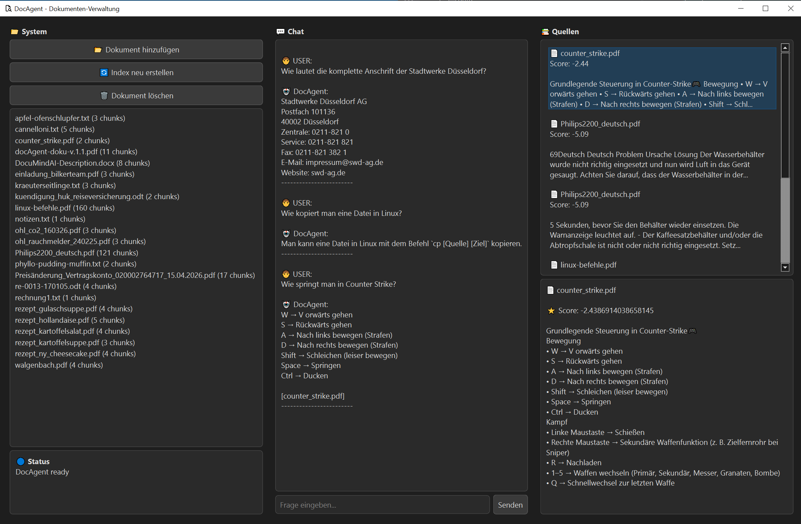

# DocAgent

**DocAgent** ist ein lokaler KI-gestützter Dokumentenassistent auf Basis von Retrieval-Augmented Generation (RAG), FAISS und lokalen Large Language Models über Ollama.

Das System ermöglicht die Verwaltung, Indizierung, Durchsuchung und Analyse persönlicher Dokumente direkt auf dem eigenen Rechner – ohne Cloud-Anbindung und ohne Weitergabe sensibler Daten an externe Dienste.

---

## Features

### Dokumentenverwaltung

* Dokumente hinzufügen
* Dokumente löschen
* Automatische Dublettenerkennung über SHA256-Hash
* Incremental Indexing für neue Dokumente
* Verwaltung über grafische Benutzeroberfläche

### Dokumentensuche

* Semantische Suche mit Embeddings
* Mehrsprachige Dokumentverarbeitung
* Re-Ranking der Suchergebnisse
* Quellenbasierte Antworten

### Dokumentenanalyse

* Fragen zu Dokumentinhalten stellen
* Strukturierte Dokumentzusammenfassungen
* Quellenanzeige mit Textvorschau
* Nachvollziehbare Antworten

### Datenschutz

* Vollständig lokale Verarbeitung
* Keine Cloud-Dienste erforderlich
* Eigene Dokumente verbleiben auf dem System

---

## Unterstützte Dateiformate

| Format | Status  |
| ------ | ------- |
| PDF    | ✓       |
| DOCX   | ✓       |
| ODT    | ✓       |
| TXT    | ✓       |
| DOC    | geplant |

---

## Technologiestack

* Python 3.11+
* PyQt6
* FAISS
* SentenceTransformers
* PyTorch
* Ollama
* NumPy
* pypdf
* python-docx
* odfpy

---

## Architektur

Benutzerfrage

↓

Agent

↓

Retriever (FAISS + Embeddings)

↓

Re-Ranking (Cross Encoder)

↓

LLM (Ollama)

↓

Antwort mit Quellen

---

## Verwendete Modelle

### Embeddings

intfloat/multilingual-e5-base

### Re-Ranking

cross-encoder/ms-marco-MiniLM-L-6-v2

### LLM

Beliebiges Ollama-kompatibles Modell, beispielsweise:

* llama3
* mistral
* qwen
* deepseek

---

## Installation

### Repository klonen

```bash
git clone https://github.com/BilkerBote/DocAgent.git
cd DocAgent
```

### Virtuelle Umgebung erstellen

```bash
python -m venv .venv
```

Windows:

```bash
.venv\Scripts\activate
```

Linux:

```bash
source .venv/bin/activate
```


### Abhängigkeiten installieren

```bash
pip install -r requirements.txt
```

### Ollama installieren

https://ollama.com

Beispielmodell herunterladen:

```bash
ollama pull llama3
```
```text
Nach der Installation müssen eigene Dokumente
über die GUI importiert werden.
```

---

## Projektstruktur

```text
DocAgent/
│
├── agent/
│   └──  core.py
│
├── helpers
│   └──  doc_inspector.py
│
├── indexing/
│   ├── build_index.py
│   ├── incremental_index.py
│   ├── rebuild_index.py
│   └── document_manager.py
│
├── llm/
│   └── ollama_client.py
│
├── rag/
│   └── retriever.py
│
├── tools/
│   ├── file_tool.py
│   └── search_tool.py
│
├── ui/
│   ├── styles.py
│   └── main_window.py
│
├── data/
│   ├── docs/
│   ├── faiss.index
│   └── documents.pkl
│
├── main.py
│
└── requirements.txt
```

---

## Nutzung

### Dokumente hinzufügen

Dokumente können direkt über die Benutzeroberfläche importiert werden.

Neue Dokumente werden:

1. geprüft
2. gehasht
3. gechunkt
4. eingebettet
5. automatisch indiziert

---

### Fragen stellen

Beispiele:

```text
Wann wurde die Versicherung gekündigt?
```

```text
Welche Rechnungen stammen aus 2025?
```

```text
Wer ist der Empfänger des Schreibens?
```

---

### Dokument zusammenfassen

Beispiel:

```text
Fasse das Dokument vertrag.pdf zusammen
```

DocAgent erstellt automatisch eine strukturierte Zusammenfassung des Dokuments.

---

## Quellenbasierte Antworten

Jede Antwort basiert auf den tatsächlich gefundenen Dokumentinhalten.

Zusätzlich werden die verwendeten Quellen inklusive Textvorschau angezeigt.

Dadurch bleiben Antworten nachvollziehbar und überprüfbar.

---

## Entwicklungsstand

Aktuelle Funktionen:

* RAG-System
* FAISS Retrieval
* Re-Ranking
* Quellenanzeige
* Dokumentverwaltung
* Incremental Indexing
* Dublettenerkennung
* Dokumentzusammenfassungen
* PyQt-GUI

Geplante Erweiterungen:

* Dokumentanalyse
* Dokumenttypen-Erkennung
* Dokumentvergleich
* Erweiterte Metadaten
* Verbesserte Retrieval-Strategien

---

## Hardware-Anforderungen

Die Anforderungen hängen hauptsächlich vom verwendeten LLM-Modell und der Größe des Dokumentenbestands ab.

### Mindestanforderungen

* Windows 10 / 11
* Python 3.11
* 8 GB RAM
* CPU mit AVX-Unterstützung
* ca. 5 GB freier Festplattenspeicher

### Empfohlen

* 16 GB RAM oder mehr
* NVIDIA-Grafikkarte mit CUDA-Unterstützung
* 8 GB VRAM oder mehr
* SSD-Speicher

DocAgent kann vollständig auf der CPU betrieben werden. Für größere Dokumentenbestände und schnellere Antwortzeiten wird jedoch eine CUDA-fähige NVIDIA-GPU empfohlen.

---

## Hinweise zum Programmstart

Beim ersten Start werden verschiedene KI-Modelle geladen und initialisiert:

* Embedding-Modell
* Re-Ranking-Modell
* FAISS-Index
* Ollama-Verbindung

Je nach Hardware kann der Startvorgang mehrere Sekunden dauern.

Dies ist normal und kein Fehler.

Nach erfolgreicher Initialisierung arbeitet DocAgent deutlich schneller, da die Modelle im Speicher verbleiben.

Bei größeren Dokumentenbeständen kann auch das Hinzufügen, Löschen oder Neuindizieren von Dokumenten einige Zeit in Anspruch nehmen.

---

## Bekannte Einschränkungen

Der aktuelle Entwicklungsstand ist bereits produktiv nutzbar. Einige Punkte befinden sich jedoch noch in der Optimierung:

* Beim Hinzufügen oder Löschen von Dokumenten kann die Benutzeroberfläche während der Index-Aktualisierung kurzzeitig nicht reagieren.
* Hintergrundverarbeitung über Worker-Threads ist für zukünftige Versionen geplant.
* Die Unterstützung von älteren Microsoft-Word-Dokumenten (*.doc) befindet sich noch im experimentellen Stadium.
* Die Qualität der Suchergebnisse hängt von der Struktur und Qualität der eingelesenen Dokumente ab.

Diese Einschränkungen sind bekannt und werden in zukünftigen Versionen schrittweise verbessert.

--- 

## Roadmap

Geplante Erweiterungen für kommende Versionen:

* Hintergrundverarbeitung für Indexierungsprozesse
* Fortschrittsanzeigen bei lang laufenden Operationen
* Erweiterte Dokumentenanalyse
* Verbesserung der Retrieval-Qualität
* Unterstützung weiterer Dokumentformate
* OCR-Unterstützung für gescannte Dokumente
* Dokumentvergleich und Änderungsanalyse

Die Entwicklung erfolgt kontinuierlich anhand praktischer Anwendungsfälle und Tests mit realen Dokumentenbeständen.

---
## Hinweis
> [!NOTE]
> **Gemeinsam am Projekt arbeiten**
> Du hast Fragen, Feedback oder eine 
> Idee für das Projekt? Darüber freue 
> ich mich sehr! Bitte nutze 
> dafür **ausschließlich** 
> die [GitHub Issues](../../issues) dieses Repositorys. So bleibt alles an einem Ort und hilft auch anderen weiter. Vielen Dank für deine Unterstützung!

---

## Autor

**Kl. Kremer**

Konzeption, Entwicklung und Architektur von DocAgent.

---

## Lizenz

Dieses Projekt wird derzeit privat entwickelt.

Eine Open-Source-Lizenz wird mit der Veröffentlichung festgelegt.

---

## Demo

